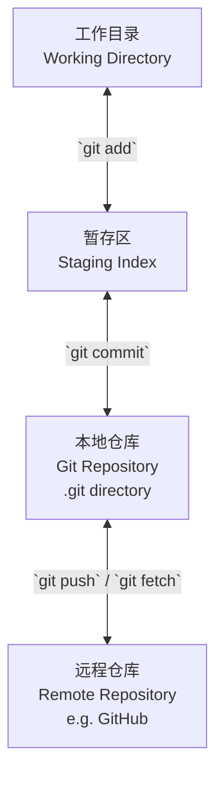

好的，为了清晰地解释 Git 的核心逻辑，我将通过 **图表** 和 **分层概念** 来为你剖析。你可以把 Git 想象成一个强大的 **快照管理系统**，而不仅仅是版本控制工具。

---

### 核心逻辑：快照，而非差异

大多数版本控制系统（如 SVN）存储的是文件的**差异（Delta）**，而 Git 存储的是整个文件的**快照（Snapshot）**。这是最根本的区别。

每一次提交（Commit），Git 都会为所有已跟踪的文件创建一个快照，并生成一个唯一的 **SHA-1 哈希值**（如 `a1b2c3d...`）来标识这次提交。如果文件没有变化，Git 不会重新存储该文件，而是链接到之前相同的快照。这使得 Git 非常高效。

---

### 图解 Git 的三个核心区域

Git 的工作流程围绕着三个主要区域。理解它们之间的关系是掌握 Git 的关键。



#### 1. **工作目录 (Working Directory)**
- **是什么**：你在电脑上看到和编辑的普通文件和文件夹。
- **特点**：它持有项目的某个版本，让你进行修改。
- **状态**：文件可以是 **已跟踪（tracked）** 或 **未跟踪（untracked）**。

#### 2. **暂存区 (Staging Area / Index)**
- **是什么**：一个位于 `.git` 目录下的文件，记录了下次提交将要包含的文件列表（它们的快照信息）。
- **作用**：它是一个准备区，让你精心挑选哪些修改需要纳入下一次提交。这让你可以只提交部分文件，甚至只提交一个文件中的部分修改。

#### 3. **本地仓库 (Git Repository / .git directory)**
- **是什么**：Git 用来存储项目元数据和对象数据库的核心部分。它位于你项目的 `.git` 隐藏文件夹中。
- **内容**：包含所有的提交历史、分支、标签等。
- **作用**：`git commit` 命令将暂存区的快照永久地保存到本地仓库中。

#### 4. **远程仓库 (Remote Repository)**
- **是什么**：位于外部服务器（如 GitHub, GitLab）上的项目副本，用于团队协作。
- **作用**：通过 `push` 和 `fetch`/`pull` 与本地仓库同步。

---

### 深入核心：Git 对象模型（数据库）

.git/objects 目录是 Git 的“数据库”，主要由四种对象构成，它们通过 SHA-1 哈希值相互链接。这是 Git 的魔法所在。

```mermaid
graph TD
    subgraph “Git 对象模型（数据库）”
        B[Blob 对象<br>存储文件内容]
        T[Tree 对象<br>存储目录结构<br>（链接 Blob 和 其他 Tree）]
        C[Commit 对象<br>包含作者， 信息，<br>并指向一个 Tree 和 父提交]
        Tag[Tag 对象<br>（如注解标签）]
    end

    C -->|指向| T
    T -->|包含| B
    T -->|可能包含| T_Sub[另一个 Tree]
    C -->|指向| Parent[父提交对象]
    Tag -->|指向| C

    subgraph “分支与引用”
        Branch[分支指针<br>（如 main）] --> C_Head[某个 Commit]
        HEAD[HEAD 指针] -->|通常指向| Branch
    end
```

#### 1. **Blob (二进制大对象)**
- **存储内容**：一个文件内容的压缩快照。**文件名并不保存在 Blob 中**。
- **生成时机**：每次 `git add` 一个文件时，Git 会根据其内容生成一个唯一的 Blob 对象。

#### 2. **Tree (树对象)**
- **存储内容**：像一个 Unix 文件系统的目录。它包含一组记录，每条记录关联着一个 **Blob 的 SHA-1（文件内容）** 或 **另一个 Tree 的 SHA-1（子目录）**，以及对应的**文件名和权限**。
- **作用**：它定义了当时刻的项目目录结构和文件内容。**一次提交对应一个顶层的 Tree 对象**。

#### 3. **Commit (提交对象)**
- **存储内容**：包含作者、提交者、提交信息、以及最重要的——**指向顶层 Tree 对象的 SHA-1 指针**（代表这次提交的项目快照），和**指向其父提交的 SHA-1 指针**。
- **作用**：形成了一条不可篡改的提交历史链。

#### 4. **Tag (标签对象)**
- **存储内容**：一个永久指向某个特定提交的指针，通常用于标记发布版本（如 v1.0）。

---

### 关键指针：`HEAD` 和分支（Branch）

- **分支（Branch）**：它本质上只是一个**指向某个提交的可移动指针**。当你创建一个新分支时，只是创建了一个新的指针。当你在这个分支上提交时，这个指针会自动向前移动。
- **HEAD**：这是一个特殊的指针，它指向**你当前正在工作的本地分支**。它可以被理解为“你当前在哪个分支上”。当你在分支 `main` 上时，HEAD 就指向 `main`。

---

### 总结逻辑流程

让我们用一个简单的例子串联所有概念：

1.  **初始化**：`git init` 创建 `.git` 文件夹，初始化 Git 数据库。HEAD 指向（尚不存在的）`main` 分支。
2.  **添加文件**：你创建了 `README.md` 并编写内容。
3.  **添加到暂存区**：`git add README.md`。Git 执行以下操作：
    - 根据 `README.md` 的内容创建一个 **Blob 对象**。
    - 将这个 Blob 的信息添加到 **暂存区（Index）**。
4.  **提交**：`git commit -m "first commit"`。Git 执行以下操作：
    - 根据暂存区创建一个 **Tree 对象**，记录此时项目的结构（`README.md` 文件对应刚才创建的 Blob）。
    - 创建一个 **Commit 对象**，包含作者信息、提交信息，并指向这个 Tree 对象（由于是首次提交，没有父提交）。
    - 将 **`main` 分支指针** 移动到新创建的提交上。
    - **HEAD** 仍然指向 `main` 分支。

之后的每次修改、添加、提交，都是这个过程的循环，并且每个新提交都会指向它的父提交，形成一条历史链。

希望这个结合图表的解释能帮助你从根本上理解 Git 的精妙设计！