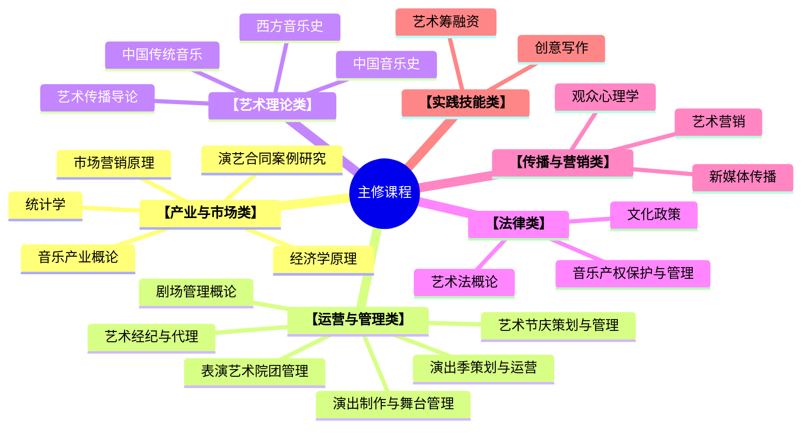

# 倪隽逸

# 🔖 基本信息

|   `text` |       `value`        |
| -------: | :------------------: |
| **出生年月** |     2002 年 10 月      |
|   **性别** |          男           |
|  **所在地** |         上海徐汇         |
|   **学校** |        上海音乐学院        |
|   **学历** |        本科四年级         |
|   **电话** |     17717864770      |
| **工作年限** |          在校          |
|   **邮箱** | junyi-ni@foxmail.com |

# 🎓 教育背景

**2022.9 - 2026.6**
- 上海音乐学院
- 艺术管理 / 本科

**主修课程**

**在校表现**
- 专业内核心课程排名位列专业前5%，曾获上海音乐学院人民奖学金。

# 💼 工作经历

****